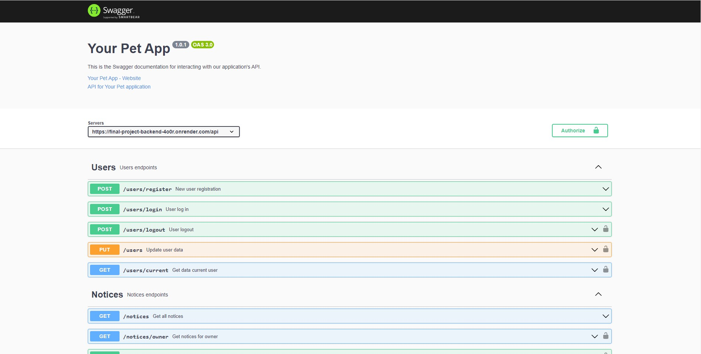

<h1 align="center">🙃 Final-project-backend 👉 <a href="https://final-project-backend-4o0r.onrender.com/api-docs/#/" target="_blank" rel="noreferrer">api-docs-link</a></h1>

<h2 align="center"> <a href="https://khailoandrey.github.io/final-project-frontend/" target="_blank" rel="noreferrer">Your Pet</a></h2>

Сайт для пошуку тварин.

<h2 align="center">This project was created using:</h2>

 &nbsp;
 &nbsp;
 &nbsp;
 &nbsp;

<h2 align="center">Final-project-frontend 👉 
<a href="https://github.com/KhailoAndrey/final-project-frontend" target="_blank" rel="noreferrer">github-link</a></h2>

